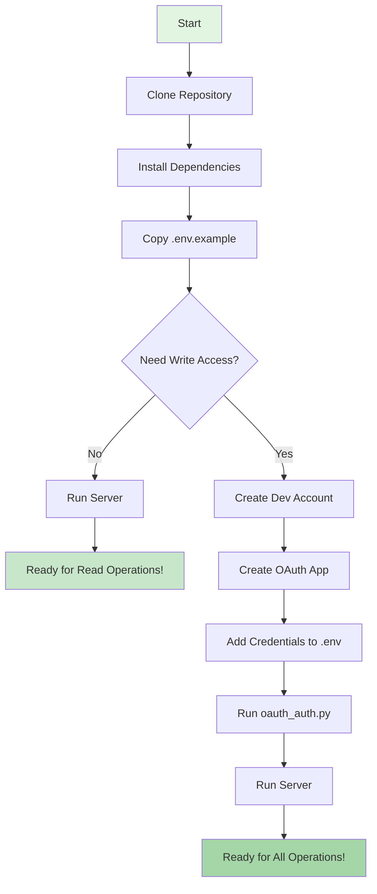

# OSM Edit MCP Setup Flow

## Visual Setup Guide



## Step-by-Step with Commands

### 🟢 Basic Setup (Read-Only)
```bash
# Takes 2 minutes
git clone https://github.com/skywinder/osm-edit-mcp
cd osm-edit-mcp
pip install -r requirements.txt
cp .env.example .env
python main.py
```
✅ You can now search, validate, and read OSM data!

### 🔵 Full Setup (Read + Write)
```bash
# Additional 5 minutes
# 1. Create account at https://api06.dev.openstreetmap.org
# 2. Create OAuth app (see README)
# 3. Edit .env with credentials
python oauth_auth.py
python test_comprehensive.py
python main.py
```
✅ You can now also create and edit OSM data!

## What Each Step Does

| Step | Purpose | Time |
|------|---------|------|
| Clone | Get the code | 30s |
| Install | Python dependencies | 1m |
| Configure | Basic settings | 30s |
| OAuth | Enable editing | 3m |
| Test | Verify setup | 1m |

## Quick Decision Tree

**Just want to search OSM data?**
→ Basic setup is enough (2 minutes)

**Need to add/edit map features?**
→ Full setup with OAuth (7 minutes)

**Using with Claude Desktop?**
→ Either setup works, depends on your needs

## Common Paths

### 🔍 Data Analyst Path
1. Basic setup
2. Use search and statistics tools
3. Export data for analysis

### ✏️ Map Editor Path
1. Full setup with OAuth
2. Create changesets
3. Add/update map features

### 🤖 AI Assistant Path
1. Either setup
2. Configure Claude Desktop
3. Natural language queries