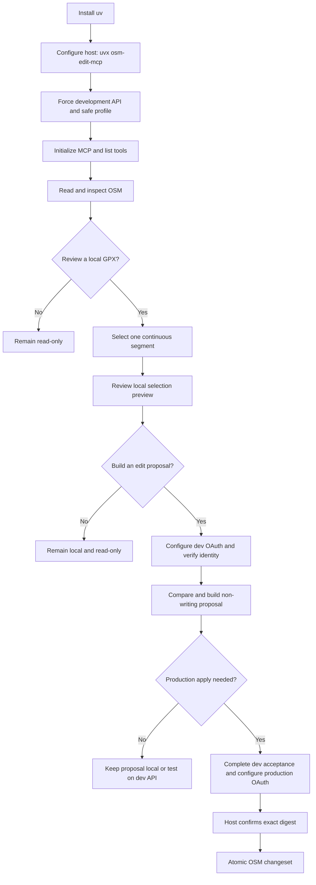

# Setup flow


```mermaid
flowchart TD
    A[Install uv] --> B[Configure host: uvx osm-edit-mcp]
    B --> C[Force development API and safe profile]
    C --> D[Initialize MCP and list tools]
    D --> E[Read and inspect OSM]
    E --> F{Review a local GPX?}
    F -->|No| G[Remain read-only]
    F -->|Yes| H[Select one continuous segment]
    H --> I[Review local selection preview]
    I --> J{Build an edit proposal?}
    J -->|No| K[Remain local and read-only]
    J -->|Yes| L[Configure dev OAuth and verify identity]
    L --> M[Compare and build non-writing proposal]
    M --> N{Production apply needed?}
    N -->|No| O[Keep proposal local or test on dev API]
    N -->|Yes| P[Complete dev acceptance and configure production OAuth]
    P --> Q[Host confirms exact digest]
    Q --> R[Atomic OSM changeset]
```

## Read-only setup

Add the released server to a JSON-based MCP host:

```json
{
  "mcpServers": {
    "osm-edit": {
      "command": "uvx",
      "args": ["osm-edit-mcp"],
      "env": {
        "OSM_USE_DEV_API": "true",
        "OSM_WRITE_PROFILE": "safe"
      }
    }
  }
}
```

Restart the host and call `get_server_info`. This path does not need OAuth and
does not expose raw write tools.

## GPX review setup

Add `OSM_TRACK_IMPORT_DIR` pointing to an absolute local directory outside the
repository. Then:

1. Analyze the GPX.
2. Select one continuous surveyed section.
3. Review the local selection preview and optional Valhalla diagnostics.
4. To build an edit proposal, authenticate a development OSM account; the
   non-writing proposal is bound to that verified identity and API target.
5. Compare with current OSM, then review warnings, topology, operations, tags,
   and the digest.

Stopping here creates no OSM changeset.

## Production setup

Production is not a quick-start option. It requires separate development and
production OAuth applications, representative development-server acceptance,
the `safe` profile, live account and permission checks, and an MCP host that
supports digest-bound elicitation.

See [MCP client setup](MCP_CLIENT_SETUP.md) and the
[main README](../README.md#oauth-and-production-use).
